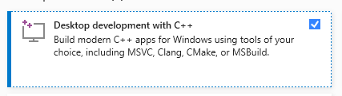

This document is compiled to teach you all the necessary basics needed to get the assignments done using **Rust**.
It is very lean, and attempts to avoid the vast majority of details unrelated to completing the assignment.

We're using Rust instead of C++ for a bunch of reasons, primarily:

* Better tooling in general
* Easier compilation across platforms *(although mac is not supported for the coursework)*
* Many of the mistakes students traditionally have been making in this course are a lot harder to make in Rust

You will not have to learn a lot of Rust to be able to complete the course.
The majority of the challenge will be learning to use OpenGL.

Should you be interested in learning more about the language, we *highly* recommend reading "*The Rust Programming Language*", a free book online that will easily help you understand Rust:

> <https://doc.rust-lang.org/book/>

Additionally, here are a few quick resources that could be useful.

* **Rust by Example:**\
  <https://doc.rust-lang.org/stable/rust-by-example/index.html>
* **Rust in easy English:**\
  <https://github.com/Dhghomon/easy_rust/blob/master/README.md#writing-rust-in-easy-english>
* **Learn Rust in Y Minutes:**\
  <https://learnxinyminutes.com/docs/rust/>
* **Rust cheat sheet:**\
  <https://cheats.rs/>\
  *(Bear in mind that this sheet is designed for people that already know the language, or at least are familiar with its concepts.)*


\clearpage {
\hypersetup{linkcolor=}
\setcounter{tocdepth}{3}
\tableofcontents
} \clearpage


# Getting Started

## Linux

Try looking for `rustup` or `cargo` in your package manager (such as `apt`,`dnf` or `pamac`).

If it is not there then go to one of these links to get the Rust compiler up and running:

> <https://www.rust-lang.org/tools/install>\
> <https://doc.rust-lang.org/book/ch01-01-installation.html>

## Windows 11

Right-click the start icon, and launch something to the end of "_Terminal (Administrator)_".

```shell
    winget install cargo
```

Then try it out by opening a new terminal window _(search for "`cmd`")_ and try typing "`cargo`" into it. If you get a help message blurb rather than an error message then you should be good to go.

## Windows 10 or below

Go to one of these links to get the Rust compiler up and running:

> <https://www.rust-lang.org/tools/install>\
> <https://doc.rust-lang.org/book/ch01-01-installation.html>

On Windows, when installing the Build Tools for Visual Studio 2019, select:

> {width=24em}

## Editing Rust

An often preferred code editor for writing Rust is VSCode, short for Visual Studio Code (<https://code.visualstudio.com/>).
With it you should install and use the official Rust extension to get proper syntax highlighting and error squiggles (i.e. linting).
For GLSL syntax highlighting we recommend installing the "Shader languages support" extension.

Optionally you can install the "Code Runner" extension, and set up the custom command to be "`cargo run`" for the project.
To get to the settings page in VSCode, use the hotkey [Ctrl+Shift+P]{.smallcaps}, then type "settings" into the resulting text box and hit [Enter]{.smallcaps}.
VSCode supports searching in the settings ui, making the rest pretty straight forward: type "custom command" to find the related setting.

Alternatives to VSCode include:

* Atom with the `ide-rust` and `language-glsl` plugins
* IntelliJ IDEA with `IntelliJ Rust` and `GLSL Support`.
* Eclipse with `RustDT` and `Eclipse Shaders`.
* Vim with the official `rust.vim` plugin, and your choice of `glsl` highlighting
* Emacs with `rust-mode` and `glsl-mode`
* Kate with `rust-racer`.

Your mileage may vary.

If you have any problems getting up and running, feel free to show up to a lab session or contacting us by email.


\newpage

# Variables and Types

## Declaring variables

We use the `let`{.rust} keyword to declare the existence of a new variable:

```rust
let x = 6;      // the type is inferred from the value
let y: i16 = 7; // here we explicitly specify a type
```

## Printing values

```rust
println!("Hello, world!"); // Exclamation mark is necessary, as println is a macro
println!("Hello, {}", x); // Hello, 6
```

## Mutability

Variables are *immutable* by default, meaning that they cannot be modified.
If you want to modify them you need to declare them as *mutable*:
```rust
let x = 6;     // immutable
let mut y = 6; // mutable
y = 3; // <- This is fine
x = 3; // <- This will cause a compiler error
```


## Integers

Integers (i.e. whole numbers) may include a *sign*, which determines whether they are negative or not.
As such we have two different types of integers: *signed* and *unsigned* integers, listed in [Table @tbl:integers].


| Signed         | Unsigned       | C++ name                             | # of bits |
| -------------- | -------------- | ------------------------------------ |:---------:|
| `i8`{.rust}    | `u8`{.rust}    | (`unsigned`{.cpp}) `char`{.cpp}      |     8     |
| `i16`{.rust}   | `u16`{.rust}   | (`unsigned`{.cpp}) `short`{.cpp}     |    16     |
| `i32`{.rust}   | `u32`{.rust}   | (`unsigned`{.cpp}) `int`{.cpp}       |    32     |
| `i64`{.rust}   | `u64`{.rust}   | (`unsigned`{.cpp}) `long long`{.cpp} |    64     |
| `i128`{.rust}  | `u128`{.rust}  | *none*                               |    128    |
| `isize`{.rust} | `usize`{.rust} | `size_t`{.cpp}                       |  depends  |

: A list of signed and unsigned integer type names in Rust, with corresponding C++ type names.
*(The C++ names are useful to know when reading the OpenGL documentation.)*
{#tbl:integers}

`isize`{.rust} and `usize`{.rust} varies with the machine architecture, but is at least large enough to reference the whole memory address space.
As such it is used when indexing into lists and arrays.

[^cpp_types]:
C++ is pretty wishy-washy on how large its integer types are depending on the platform, but Rust includes their size measured in bits in its name.
Assuming a 32- or 64-bit computer architecture that supports 8-bit operations we can compare them as we do here.

You declare the *type* of a variable by:

```rust
let a: i8 = 10; // signed, 8 bit
let b: u8 = 10; // unsigned, 8 bit
```

Alternatively you can let the Rust compiler *infer* the type of the variable from the assigned value.
Integer literals default to `i32`{.rust}, but this can be changed with a suffix:

```rust
let a = 10;   // signed, 32 bit
let b = 10i8; // signed,  8 bit
let c = 10u8; // unsigned, 8 bit
let d;        // ?!?
d = 10u8;     // Aha! unsigned, 8 bit !
```

Type declarations are thus usually not needed, since the defaults `i32`{.rust} and `f64`{.rust} for integer and floating point literals usually are sufficient.

## Floating Point numbers

Non-whole numbers are usually represented with floating point representations: floats!
In Rust, `f64`{.rust} is the default floating point type, and is known in C++ land as a `double`{.cpp}.
`f32`{.rust} is the 32-bits wide variant, and is known as a `float`{.cpp} in C++.

```rust
let x = 75.0;      // This is inferred as a f64, the default
let y: f32 = 75.0; // This is a f32 declaration. The literal gets converted.
let z = 75.0f32;   // This literal is a f32, and z is inferred as such.
```
You will probably have to specify that you want 32-bit floating point values when using OpenGL.


## Bool

In Rust we represent boolean values as `bool`{.rust}.
Its members are `true`{.rust} and `false`{.rust}.

```rust
let a: bool = 5 > 3;  // true
let b: bool = 5 < 3;  // false
let c: bool = a && b; // false
assert!(a || b);      // true (a run-time check, will panic/crash if false)
```

## Tuples

Tuples are simple structures are commonly used to store multiple different types of values in a fixed-size block.
Useful for stuff like coordinates!

```rust
let foobar: (i32, i32, f32) = (6, 7, 1.2);
let point_2d: (f32, f32) = (1.0, 3.4);
```

You can *unpack* a tuple, assigning their inner values to variables:

```rust
let (a, b, c) = (1, 2, 3);
assert!(a == 1);
```

## Arrays and vectors

To store a sequence of values of the same type, use either *arrays* or *vectors*.
The size of *arrays* must be known at compile-time, and can therefore be stored on the program *stack*.
*Vectors* may be dynamically sized and resized, and are as such stored in dynamic memory: the *heap*.

### Arrays {.unlisted .unnumbered}

Storing arrays of numbers on the stack can be done like so:
```rust
let numbers = [  // array type and size inferred
    1, 2, 3, 4, 5, 6, 7,  // trailing comma is permitted ;-)
];
// or
let f32_numbers: [f32; 5] = [ // explicit type and size
    1.0, 2.0, 3.0, 4.0, 5.0,
];
```

### Vectors {.unlisted .unnumbered}

You should for the most part **use vectors instead than arrays** for these assignments.\
Storing a sequence of numbers on the heap is done like this:

```rust
let numbers_vec             = vec![1, 2, 3, 4, 5];
let numbers_vec_2: Vec<f32> = Vec::new();          // `::new` infers type from declaration

let numbers_vec_3           = Vec::<f32>::new();   // type passed into `::new` explicitly

let numbers_vec_4: Vec<f32> = vec![1.0, 2.0, 3.0]; // The literals would alone result
                                                   // in a Vec<f64>, but the declaration
                                                   // converted it.

```

Storing numbers on the heap allows you to append new elements:
```rust
numbers_vec.push(6); // A vector must be declared as `mut` if you
                     // want to push new values to it!
```

## Iterating over arrays and vectors

The easiest way to iterate over a vector is with a `for`{.rust} loop:

```rust
let numbers = vec![1, 2, 3, 4, 5, 6]:
for number in numbers {
    println!("number is {}", number);
}
```


## Scoping, Borrowing and Ownership

Although we provide a brief overview of "ownership" here, we recommend you read the following to get a deeper understanding:
<https://doc.rust-lang.org/book/ch04-00-understanding-ownership.html>

Ownership is one of the things that makes Rust unique, and is the feature that allows the language to not have to be *garbage collected* during runtime while still retaining memory safety guarantees.

If you want to "move"[^copy_trait] a variable somewhere without losing ownership, you can create a *borrow*.
**The key takeaway is:** a variable is removed from memory when it goes out of *scope*, but not when a borrow goes out of scope.

A *scope* is defined by the `{}`{.rust} brackets.
Any variable defined with `let`{.rust} inside of a scope gets deleted once you leave the scope.

```rust
{ // this is the beginning of a *scope*
    let b = 10; // declaration of `b`
} // `b` goes out of scope here
{
    let c = String::from("Hello");
    let g = String::from("World");
    let n = 13;
    {
        let borrowed_c = &c;
        let copied_n   = n;  // copied, since `i32` implements `Copy`
        let moved_g    = g;  // moved,  since `String` does not implement `Copy`
    } // `borrowed_c` goes out of scope, c is untouched
      // `copied_n`   goes out of scope, n is still fine
      // `moved_g`    goes out of scope, g no longer valid
    println!("c: {}", c); // no problem
    println!("n: {}", n); // Also fine
    println!("g: {}", g); // ERROR!
} // c,g,n goes out of scope
```

[^copy_trait]:
Moving ownership is only a problem for "complicated" objects and data -- the kind of values you can't store on the stack.
The specific reason why is that most builtin *"simple"* types implement the `Copy`{.rust} Trait by default, which means they instead get copied when they are attempted to be moved.
You can read more about Traits in the Rust book.


# Functions

Calling a function will very often require you to borrow
the arguments with `&` instead of passing them in directly:

```rust
let rotate_amount: f32 = 3.0 / 4.0 * glm::pi;
let y_axis = glm::vec3(0.0, 1.0, 0.0);
let rot = glm::rotation(rotate_amount, &y_axis);
```

Simple types such as numbers can be used directly, but vectors has to be borrowed.
If you get errors while calling functions, inserting a `&`{.rust} usually fixes it.

Some functions ask you for a *mutable reference* to some value.
As such it is not enough to simply make the variable itself mutable in this situation, you actually need to explicitly say that a reference to that variable permits mutation.
The way to do that is:

```rust
let mut variable = 0;
some_function(&mut variable);
```

## Defining functions

A function signature in Rust looks like this:
```rust
fn function_name(argument_1: f32, argument_2: i8) -> u8 {
    // Function body                                  ^ return type
}
```

A function with no return value looks like this:
```rust
fn void_func() {
    // Function body
}
```

A function will return the final expression in its body by default, which lets your functions look a bit less cluttered
```rust
fn double_value(value: f32) -> f32 { value * 2 }
```

Semicolons turn expressions into void statements:
```rust
fn no_return_value(value: f32) { value * 2; }
```

The `return`{.rust} statement still works as expected:
```rust
fn double_value(value: f32) -> f32 { return value * 2; }
```

## Generic functions

Calling a generic function with a *type parameter* requires you to use the "turbofish" operator (`::<>`) to specify the type:
```rust
let byte_size_of_f32 = mem::size_of::<f32>();
//                                      ^ type argument
```

If the generic function uses the generic type (`T`) in one of its input parameters:
```rust
fn double<T>(input: T) -> T;
```
, then it is able to *infer* `T` from the input:
```rust
println!("I doubled the input", double(4)); // no turbofish!
```


# Interfacing with OpenGL

OpenGL was designed for C and C++.
We use simple bindings to the C interface in Rust.

## Unsafe

Some things, such as dereferencing[^dereferencing] a raw pointer, or calling a function from outside of Rust is always illegal in "safe" Rust.
There is simply no way for the compiler to guarantee that nothing will go wrong (read; segfault) when doing it, so you must tell the compiler that you know what you're doing in order to be allowed such power.

[^dereferencing]:
"*Dereferencing*" a pointer means accessing the place in memory a pointer points at.

C and C++ on the other hand always operate in such an unsafe manner, and the OpenGL interface was designed assuming so.

We signal to the compiler that we're about to do something dangerous by using the `unsafe`{.rust} keyword:

```rust
// Let's dereference null! :D
unsafe {
    let p: *const i32 = std::ptr::null();
    let extremely_dangerous = *p; // Hard crash!
}
```

When you need to return a value from an unsafe block, there are a couple of different ways to go about doing so.
The first is to declare the variable outside of the block without assigning it a value, and then assigning it inside of the unsafe block.
```rust
let value; // no type annotation needed
unsafe {
    value = unsafe_operation(); // type inferred from here
}
```

The second option is to return a value from the unsafe block, as Rust supports using blocks on the right hand side of an assignment:
```rust
let value = unsafe {
    unsafe_operation() // notice the lack of a semicolon: an implicit return
}; // This semicolon terminates the `let` statement
```

We can also mark whole functions as `unsafe`{.rust}:

```rust
unsafe fn my_function() {
    // something dangerous
}
```

Usage of the `unsafe`{.rust} keyword should be minimized as much as possible in general, making it easier to locate mistakes.

## The OpenGL C bindings

Calling OpenGL functions is our way of communicating with the GPU.
Every single OpenGL function call is **unsafe**, as they are simply raw bindings to C functions.
This means that *all* calls to OpenGL functions must be within an `unsafe`{.rust} block or a function (`fn`{.rust}) marked `unsafe`{.rust}.

While OpenGL functions names in C++ will have `gl` as a *prefix*, in Rust they are instead *namespaced* under `gl`{.rust}.
In other words: `gl::SomeFunction`{.rust}.
This also applies to the "`GL_`" part of OpenGL enumerators.
So if you find a function you want to use online, you'll have to *translate* it a little to be able to use it in Rust:

```c++
glSomeFunction(GL_SOME_VALUE);
```
, in C or C++ will in Rust become:
```rust
unsafe { gl::SomeFunction(gl::SOME_VALUE) };
```


## Pointers

Pointers are commonly used in C and C++, and simply point to some address in memory.
They are quite powerful, but commonly regarded as unsafe.
Pointers may include the *type* of the data it is pointing at.
In C and C++, `*int`{.cpp} is read as "int pointer", and `*void`{.cpp} is read as "void pointer"[^void].
In Rust they equate to `*mut i32`{.rust} and `*mut c_void`{.rust} respectably.

[^void]:
"Void" means missing.
"Void functions" return nothing.
"Void pointers" may point at *anything*.

Sometimes when the Hitchhiker's guide to OpenGL suggests you use `0`{.rust} as the input value, Rust will complain that it expects a pointer.
While C++ is perfectly happy to implicitly coerce `0`{.rust} into a pointer for you, Rust requires you to be a bit more explicit about it.
You can placate Rust by either using `ptr::null()`{.rust} or `0 as *const c_void`{.rust} in these situations.

One way OpenGL often returns values is by modifying variables provided as pointers.
This is because most calls to OpenGL support reading and returning an arbitrary amount of values, and using pointers used to be a simple (in the days of olde) work-around for the limitation of functions returning just a single item.

```rust
let mut result: u32 = 0;                 // initialized to 0, doesn't matter really.
                                         // What IS important is that it reserves
                                         // 4 bytes in memory

gl::SomeAction(&mut result as *mut u32); // We provide a mutable pointer to `result`.
                                         // The `as *mut u32` part is usually optional.

println!("Result is: {}", result);       // the function modified `result` as a
                                         // side-effect by directly writing to
                                         // where in memory it is located. As a
                                         // result, this now prints something
                                         // else than 0
```


\newpage

> > **The following information is only needed from assignment 2 and onward.**

# GLM - OpenGL Mathematics


The Hitchhikers guide to OpenGL details the data types found in GLSL -- the OpenGL Shader Language.
To replicate the data types in GLSL and their supported operations on the CPU, some clever guys created the GLM library.
We specifically will be using a variant known as [`nalgebra-glm`.](https://docs.rs/nalgebra-glm/0.15.0/nalgebra_glm/)


## Vectors and swizzling

The type `glm::Vec3`{.rust} represents a column vector with 3 elements. Similarly, we have `glm::Vec2`{.rust} and `glm::Vec4`{.rust}.
The following three vectors are equivalent:

$$
    p={\begin{bmatrix}{1}\\ {2}\\ {3}\end{bmatrix}}
$$

```rust
let p = glm::Vec3::new(1.0, 2.0, 3.0);

let p = glm::vec3(1.0, 2.0, 3.0);
```

*(
The lowercase `vec3` function is basically just an alias to `Vec3::new`{.rust}
)*

To access the scalar elements of a vector you can address them using the `[]` operator, or referring to them using the common component names assigned by GLM and GLSL:

```rust
let v = glm::vec4(1.0, 2.0, 3.0, 4.0);
v[0]  ==  v.x  ==  v.r   // these have the value 1.0
v[1]  ==  v.y  ==  v.g   // these have the value 2.0
v[2]  ==  v.z  ==  v.b   // these have the value 3.0
v[3]  ==  v.w  ==  v.a   // these have the value 4.0
```

This notation follows from how a `Vec4` can be used to represent both homogeneous coordinates (XYZW) and colors (RGBA).

From such a vector, you can extract the components in any order you'd like using **swizzling**:

```rust
let v = glm::vec4(1.0, 2.0, 3.0, 4.0);
v.xyz()  ==  glm::vec3(1.0, 2.0, 3.0)
v.zyx()  ==  glm::vec3(3.0, 2.0, 1.0)
v.xx()   ==  glm::vec2(1.0, 1.0)
```


## Matrices

The type `glm::Mat4`{.rust} (an alias to `glm::Mat4x4`{.rust}) represents a $4{\times}4$ matrix containing 16 elements. Similarly, we have a `glm::Mat3`{.rust}.
These following three matrices are equivalent:

$$
    M = {\begin{bmatrix}{a}&{b}&{c}\\ {d}&{e}&{f}\\ {g}&{h}&{i}\end{bmatrix}}
$$

```rust
let M = glm::Mat3::new(
    a,  d,  g,   // 1st column
    b,  e,  h,   // 2nd column
    c,  f,  i,   // 3rd column
);

let M = glm::mat3(
    a,  d,  g,   // 1st column
    b,  e,  h,   // 2nd column
    c,  f,  i,   // 3rd column
);
```
*(
The lowercase `mat3` function is basically just an alias to `Mat3::new`{.rust}
)*

Notice how the values are mirrored/flipped along the diagonal?
This is because matrices in GLM and GLSL are [**column major**.](https://thebookofshaders.com/glossary/?search=mat4)
If you’re not familiar with the term, column major means that you first address the column, then the row.

As such, when addressing a single element in a matrix we have:

```rust
M[(column, row)]
M[(0, 1)]  ==  d
```

Notice how we use a `(usize, usize)`{.rust} tuple to index into the matrix with the `[]` operator.[^mat_index]

[^mat_index]: For those interested, this is implemented here:
<https://docs.rs/nalgebra/0.29.0/nalgebra/base/struct.Matrix.html#impl-Index%3C(usize%2C%20usize)%3E>


Luckily, flipping a matrix along the diagonal is a common operation known as *transposing* a matrix.
The mathematical notation for matrix transposition is $M^T$.
In GLM and GLSL, the function `transpose` implements this for us:

```rust
let M = glm::transpose(glm::mat3(
    a,  b,  c,   // 1st row
    d,  e,  f,   // 2nd row
    g,  h,  i,   // 3rd row
));
```


## Transformation matrix functions

Here we showcase a few (simplified rust signatures of) GLM functions you’ll want to use to produce various transformation matrices, along with examples of how you’d use them.

> **Important:** Notice that the functions return a `glm::TMat<T, D, D>`{.rust}, the most generic form of a matrix.
`T` is the type of the elements, and the `D`s are the two dimensions.
`glm::Mat4`{.rust} is actually equal to `glm::TMat4<f32>`{.rust}, which in turn is equal to `glm::TMat<f32, 4, 4>`{.rust}.

For this reason, every time you use any of the matrix generation functions from the GLM library, you should be specifying the *type* you want for the resulting variable, or at least make sure Rust is able to infer/deduce it based on how you use the returned value.
Otherwise you might end up with a matrix of either the wrong size, or with `f64`{.rust} elements!
The examples below handles this properly.

### Identity matrix {.unlisted .unnumbered}

To generate an identity matrix, we use the `glm::identity`{.rust} function, which looks like:
```rust
fn glm::identity(scale: &glm::Vec3) -> glm::TMat<T, D, D>;
```
Example usage:
```rust
let identity: glm::Mat4 = glm::identity();
```

### Translation matrix {.unlisted .unnumbered}

To generate a translation matrix, we use the `glm::translation`{.rust} function, which looks like:
```rust
fn glm::translation(direction: &glm::Vec3) -> glm::TMat4<T>;
```
To generate a $4{\times}4$ matrix, that translates by $[1, 2, 3]^T$:
```rust
let translation: glm::Mat4 = glm::translation(&glm::vec3(1.0, 2.0, 3.0));
```

### Scaling matrix {.unlisted .unnumbered}

To generate a scaling matrix, we use the `glm::scaling`{.rust} function, which looks like:
```rust
fn glm::scaling(scale: &glm::Vec3) -> glm::TMat4<T>;
```
To make a $4{\times}4$ matrix that scales the input with coefficients $[s_x, s_y, s_z]^T$:
```rust
let scaling: glm::Mat4 = glm::scaling(&glm::vec3(sx, sy, sz));
```

### Rotation matrices {.unlisted .unnumbered}

To generate a rotation matrix, we use the `glm::rotation`{.rust} function, which looks like:
```rust
fn glm::rotation(angle: f32, axis: &glm::Vec3) -> glm::TMat4<T>;
```
It takes in an `angle` measured in radians, and an `axis` which is the (unit) vector to rotate around.

To rotate $45^\circ$ around the X axis:

```rust
let rotation: glm::Mat4 = glm::rotation(45.0f32.to_radians(), &glm::vec3(1.0, 0.0, 0.0));
```


## Composing transformation matrices

In computer graphics it is customary to multiply transformations on the right hand side of column vectors, and GLM and OpenGL was designed with this in mind.
As such we encourage you to structure your transformations something like this:

```rust
let mut trans: glm::Mat4 = glm::identity();  // begin with an empty transformation
trans = glm::rotation(angle, &axis)              * trans; // apply a rotation
trans = glm::scaling(&glm::vec3(sx, sy, sz))     * trans; // then apply some scaling
trans = glm::translation(&glm::vec3(tx, ty, tz)) * trans; // followed by a translation
```

Using this structure, you can read the transformations applied ordered downward.
It also enables you to quickly enable/disable transformations by commenting them, and reorder them by just moving whole lines.
Most code editors allows you to move the current line with [ALT+Up]{.smallcaps} and [ALT+Down]{.smallcaps}.
